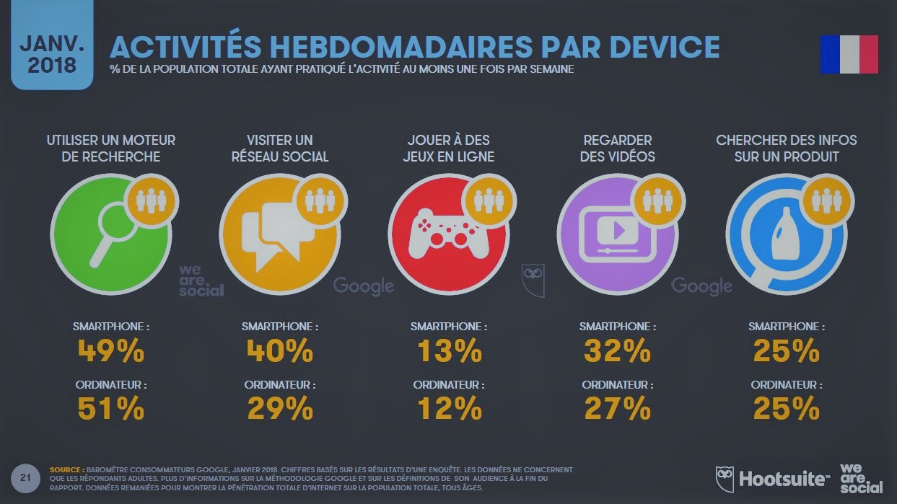
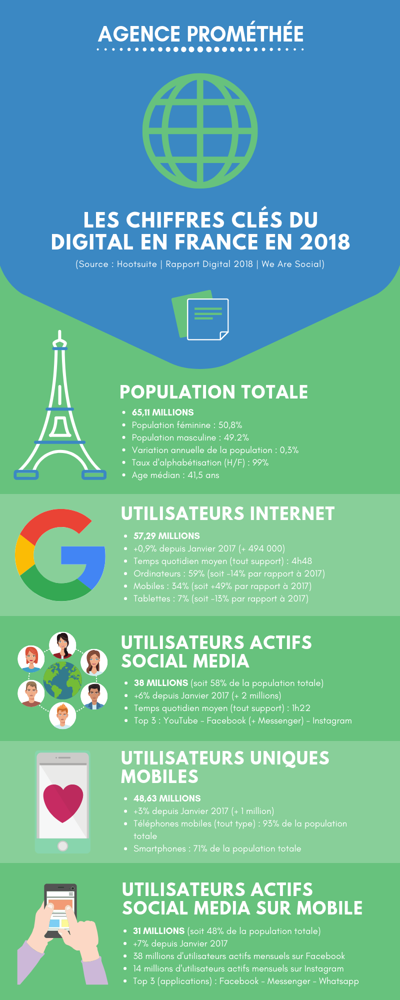

Le dernier rapport Hootsuite/We Are Social (2018) autour du Digital en France nous prouve une fois de plus à quel point l’univers du Digital fait partie de notre vie quotidienne à tous, ou presque…

Notre besoin de mobilité connectée change nos habitudes et nos comportements, tant sur le plan personnel que professionnel. L’évolution constante des technologies offre une place confortable au Digital, d’où l’importance de s’acculturer aux outils et technologies numériques. 

Pour prendre conscience de cette croissance digitale, rien de plus parlant qu’une infographie autour des chiffres clés du Digital en France en 2018 : 

Ces chiffres confirment la tendance et démontrent qu’il est plus que nécessaire de se positionner sur ce marché du Digital, encore en plein essor. Malgré de nombreuses appréhensions dans le processus de digitalisation des entreprises, il existe également de nombreux avantages dans la transformation digitale : 

\- Aller à la rencontre de vos cibles

\- Elargir votre audience

\- Fidéliser vos cibles

\- Mettre en valeur votre expertise et professionnalisme

\- Communiquer autrement mais efficacement

Certes, la mise en place de nouvelles **stratégies digitales** reste complexe tant cet univers est vaste, il est donc nécessaire de faire appel à des **experts** en la matière ! Bien plus qu’une simple **agence digitale, Prométhée** vous accompagne tout au long de votre **projet digital**
pour une **transition** efficace et sereine. Principalement fondée sur la **collaboration, le conseil et la formation**, notre agence située à **Limoges**, vous apporte de nombreuses **solutions digitales personnalisées**. Alors, êtes-vous enfin prêt à sauter le pas… digital ?
