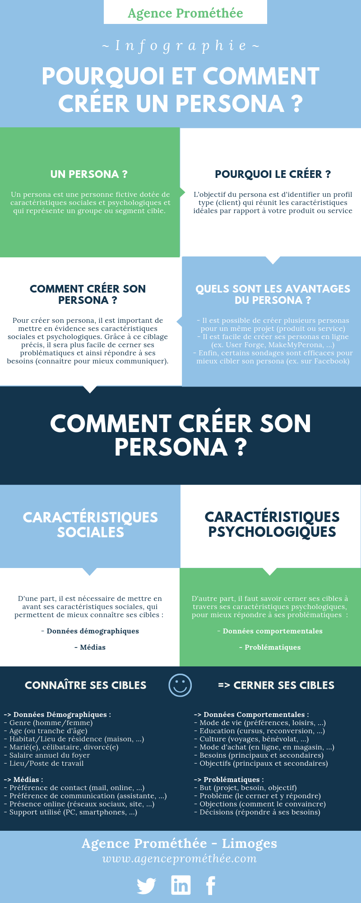

Tout le monde n’est pas forcément intéressé par vos produits ou services. Autrement dit, **cibler** tout le monde, c’est ne **cibler** personne ! 

Il est donc impératif de **cibler** sa **clientèle** afin de : 

\- savoir à qui l’on s’adresse et ainsi utiliser le bon langage, 

\- connaitre ses **problématiques** et ainsi répondre à ses **besoins**,

\- toucher uniquement les personnes susceptibles d’être réellement intéressées par votre offre. 

Pour vous aider dans cette démarche, faites confiance à votre **persona** ! Pour tout savoir sur le **persona**, pourquoi et comment le créer, suivez les conseils de **Prométhée**: 

Vous l’avez compris, pour mieux vous positionner sur le marché sur lequel vous êtes implanté, pensez aux personas ! Vous pourrez ainsi déployer une stratégie efficace et adaptée à votre marché : connaître pour mieux communiquer.
