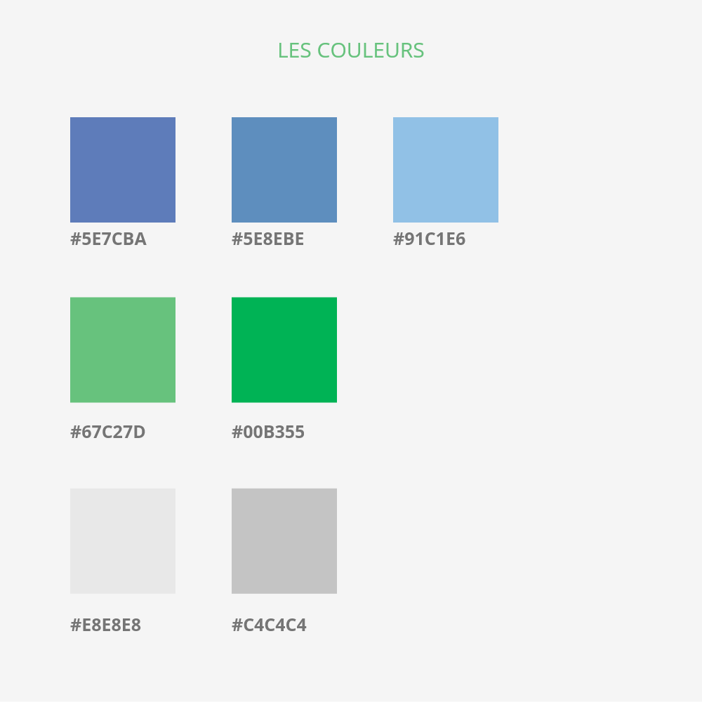

Néanmoins, le design d’un site par exemple vas respecter des étapes bien précises afin de ne pas risquer de manquer sa cible, ou d’être hors sujet.

Ces étapes constituent le fer de lance d’un designer, c’est son fils rouge, grâce à ça, il réduit grandement sa marge d’erreur, et peut éviter d’avoir a produire du travail superflus ce qui est une perte de temps pour l’entreprise et le client.

En quoi consistes ces étapes ?

C’est assez simple en fait, même si chacun les appliques un peu a sa façons, elles restent assez similaires et universelles malgré tout.

Par exemple, comme on va le détailler dans ce premier article, on commence par bien cerner avant tout travail les besoins du client, mais aussi et surtout, l’identité qui s’en dégage ! 

Comprendre l’esprit qui anime le client et/ou son projet son primordiaux, car ils vont dessiner la ligne directrice à adopter.

Parfois, le client n’as pas d’idée, ou ne maîtrise pas forcément la forme et tout le background visuel par exemple de son projet, et dans ce cas, c’est au designer de faire force de proposition. Bien sûr, il faudra être en accord avec les principes de communication pour toucher au mieux le publique visé, et ça, c’est souvent un travail qui se fait main dans la main avec l’équipe de marketing !

Une fois l’esprit bien saisit, et bien établit avec si possible, l’aide du client, il est temps de faire un premier pas !

Commencer par une palette de couleurs peut être un bon début.

Dans notre cas, il nous as semblé evident que pour une entreprise solidaire de statu SCOP, qui œuvre pour l’ESS nos couleurs allaient tirer vers du vert en principal, pour le côté naturelle d’une forme équitable de société, et du bleu, comme seconde couleur pour le côté travail, et ouverture sur autrui.

La palette étant un bon début, on peut maintenant attaquer la Charte Graphique !

On va accorder ces couleurs à des polices, et commencer à travailler le logo.

Là encore il sera nécessaire de faire des retours client si le designer travailler pour un client afin d’être sûr que l’esprit du logo est à la convenance de ce dernier.

Il faut garder à l’esprit qu’a ce stade la charte graphique ne sera pas vraiment terminée car elle s’implémentera de nouveaux éléments graphiques ajoutés lors de la conception des maquettes par la suite, mais à ce niveau, on a déjà une bonne idée de l’identité visuelle du site ou du projet en général !

Une fois notre palette et ébauche de charte graphique établis, il est temps de passer à quelque chose de plus concret, à savoir donner une forme a notre site.

A suivre dans la prochaine article, un deuxième pas.
