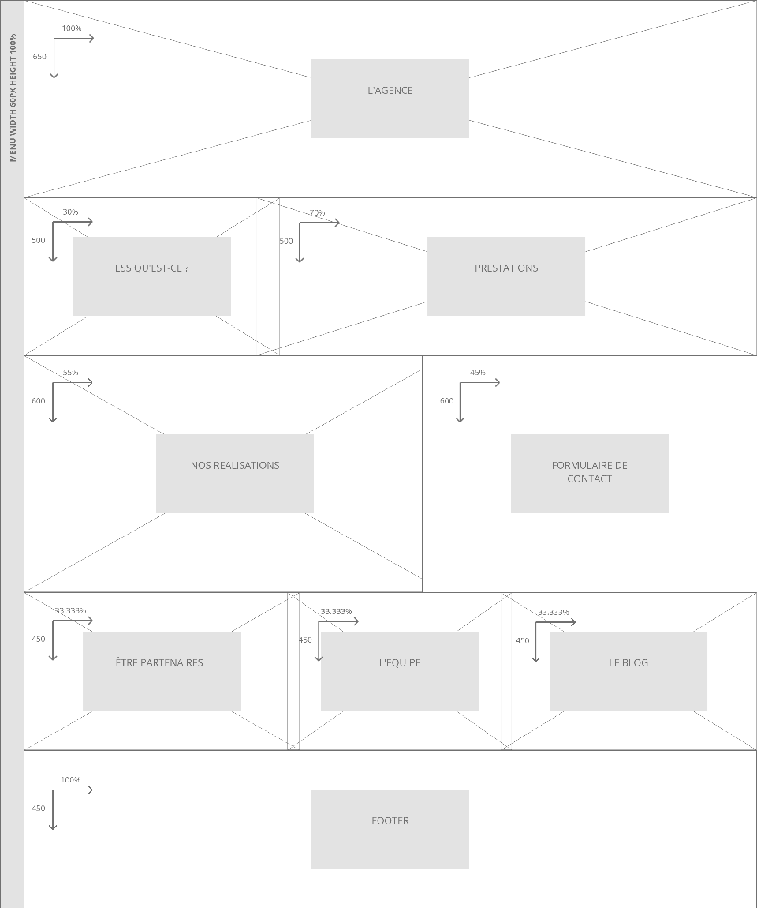

Maintenant, il est temps de donner une forme à nos couleurs !

Pour ça, le designer ne doit pas céder au sirènes de la facilité en construisant directement une maquette «propre» du site.

Pourquoi donc ?

Et bien simplement parce qu’une maquette final demande du temps à être créer et que la retoucher en prend encore plus, et que bien sûr, il est très très rare de réussir a créer un résultat parfait dès le début.

C’est pourquoi on commence par une étape dite, «fils de fer» voir même plus basique encore avec une pré étape «zoning» que nous allons justement détailler ici.

Voilà ce qu’est un zoning. Pas très sexy n’est-ce pas ?

Et pourtant ! C’est une étape très importante, car c’est elle qui va nous donner l’esprit globale du site. C’est le moment où on définit ce que va être la base de l’ossature de notre site. Comment un veut qu’il prenne sa place, et comment on voudrait agencer les éléments de façon très schématique.

Le zoning étant simple, c’est un premier jet qui permet a tout le monde d’argumenter et de donner son point de vu. Il sera simple et rapide a modifier, et minimisera les pertes de temps !

Pour aller un peu plus loin, pourquoi avoir choisit manifestement un design «full width» (tout en largeur, occupant tout l’écran quelque soit ça taille) ?

Et bien, parce que c’est un design qui comporte une meilleur harmonie, remplissant tout l’écran, on élimine des points de cassures qui donne une impression de site étriqué, ou inutilement compliqué.

Dans la perspective d’ouverture sur autrui par exemple pour vous parler thématique, un site qui respire, qui est large et fluide, donne un impression bien plus positive qu’une liste verticale étriquée et rigide.

Occuper l’espace sans le surcharge, voilà qui donne une vrai impression d’harmonie et de naturel dans la conception !

Dans le prochaine article de la série, on parlera de l’étape suivante, un premier jet avancé, un wireframe de l’accueil, qui donne enfin les lignes du site et sa forme presque définitive brute !
